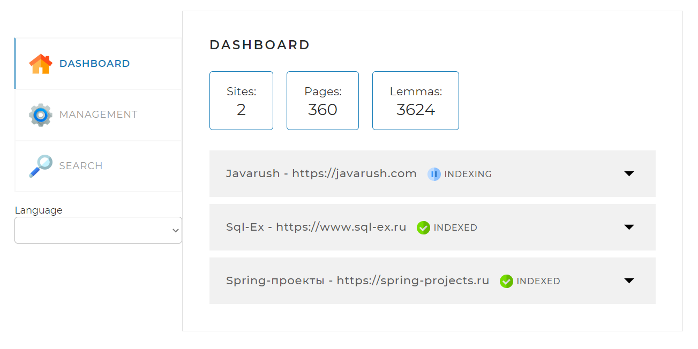
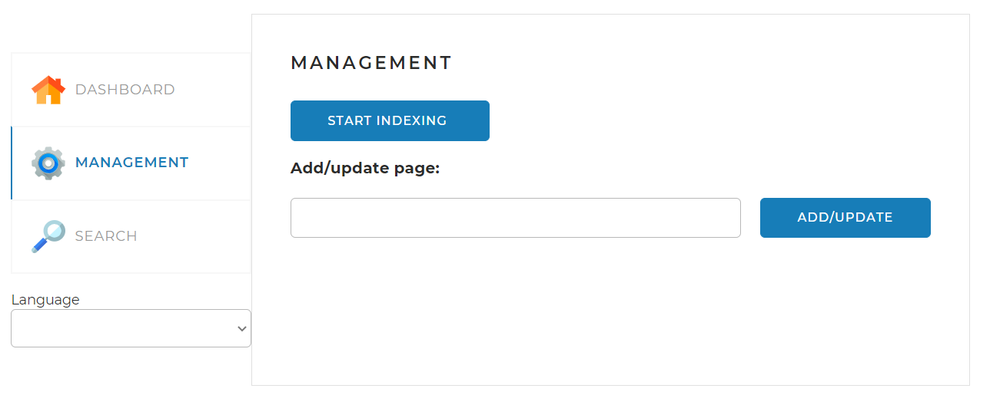
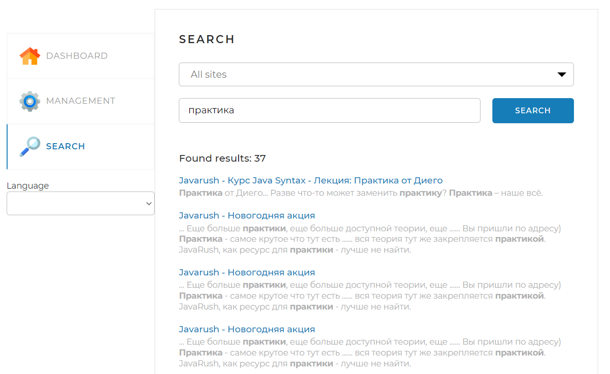

# Поисковый движок
Сервис является реализацией поискового движка, который помогает посетителям быстро
находить информацию на заранее проиндексированных сайтах, используя поле поиска.

## Технический стек
Клиент: Java 17, Spring Boot, Spring Data, Hibernate, 
Apache Maven, Lombok, Thymeleaf, Apache Lucene, Jsoup

БД: MySQL

## Локальный запуск
Перед запуском приложения необходимо создать схему с наименованием search_engine. 
Ввести локальные имя пользователя и пароль в 
файле <i>application.yaml</i>.

Проект может быть скомпилирован и запущен с помощью IDE Intellij IDEA.
## Пользовательский интерфейс

Пользовательский интерфейс содержит 3 основные вкладки, доступные для взаимодействия.

### Dashboard

Вкладка по умолчанию. Содержит информацию о сайтах, информацию о состоянии процесса индексации, количество сохранённых страниц и количество лемм.

### Management

Вкладка содержит поле для текста, которое позволяет ввести URL страницы для индексации или переиндексации. 
При нажатии на кнопку <i>START INDEXING</i> запускается индексация списка сайтов, указанных в <i>application.yaml</i> файле.
Индексацию можно прервать нажатием той же кнопки.

### Search

Вкладка содержит текстовое поле для пользовательских запросов. Изначально при нажатии на кнопку <i>SEARCH</i> поиск 
ведётся по всем проиндексированным сайтам.
Используя выпадающий список можно выбрать конкретный, если это необходимо.
